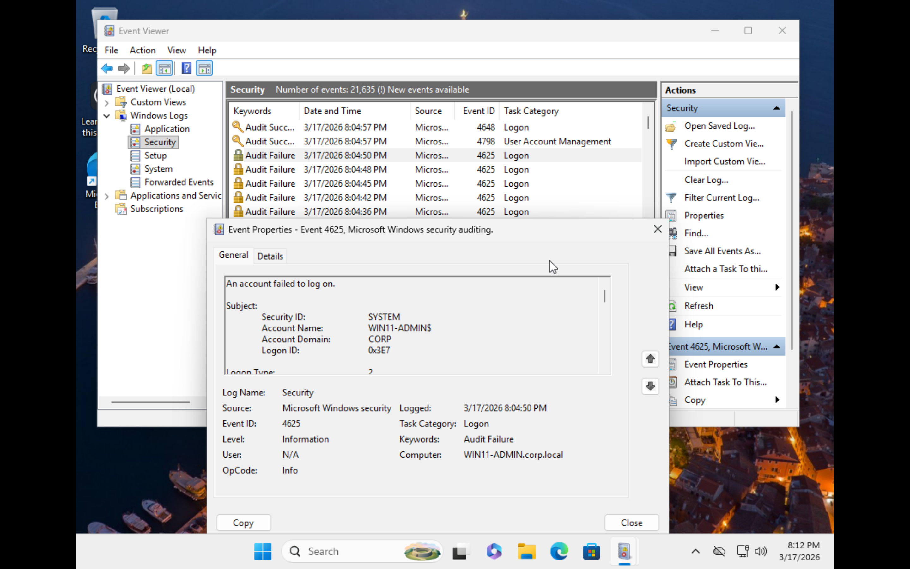
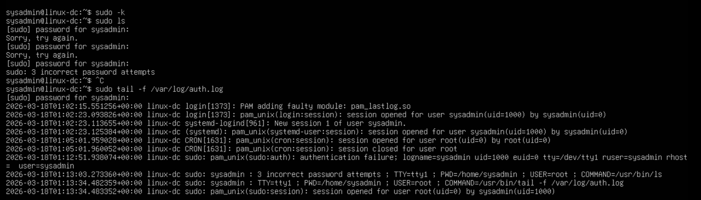
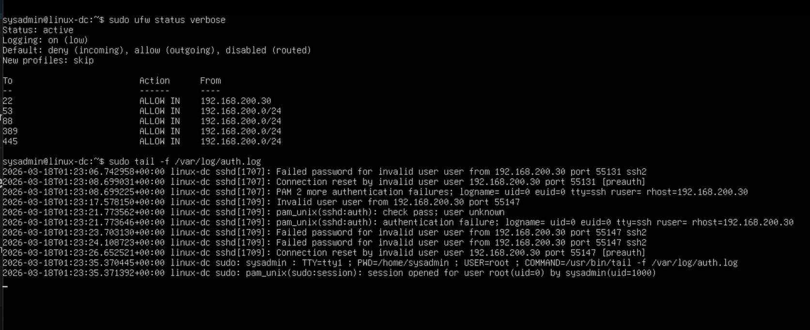

# Authentication Failure Simulation

## Objective
Simulate authentication failures to generate security logs.

## Windows Testing

Performed multiple failed login attempts.
Observed Event ID 4625.

## Linux Testing

Generated failed sudo and SSH attempts.
Observed entries in /var/log/auth.log.

## Key Findings
Failed authentication attempts generate identifiable log patterns.

## Security Relevance
These logs are critical for detecting brute force attacks and unauthorized access attempts.
