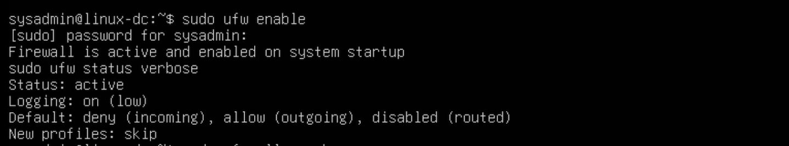
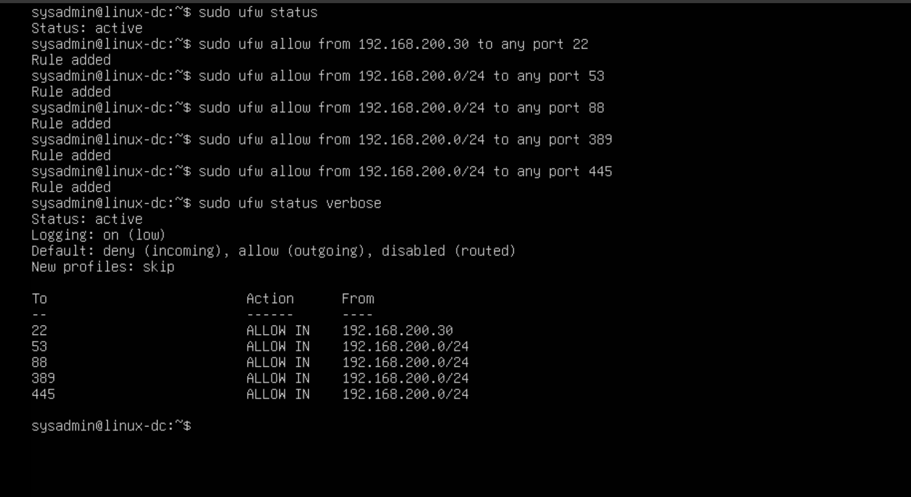

# Linux Firewall Hardening with UFW

## Objective
The objective of this lab was to reduce the attack surface of the Domain Controller by implementing a host-based firewall. Only required services were allowed while all other inbound traffic was blocked.

### Step 1 – Check Firewall Status

Run:

sudo ufw status

Initial state:

Status: inactive

### Step 2 – Enable the Firewall & Verify Default Policy

This activates the firewall and applies default policies and creates a default deny inbound security model.

### Step 3 – Allow Required Domain Services

The Domain Controller must expose specific services to support authentication.

- Port 22 for SSH from client
- Port 53 to allow DNS queries from internal network
- Port 88 for kerberos authentication
- Port 389 for LDAP
- Port 445 for SMB 

## Security Impact
The firewall now enforces a least privilege access model.

Only trusted internal systems can access critical domain services.

### Benefits include:
- reduced attack surface
- protection against unauthorized access
- improved network segmentation

## Outcome

The Domain Controller now operates with a hardened host firewall configuration while still allowing required domain services.

This configuration will also generate useful firewall telemetry that can later be analyzed by the SIEM.
