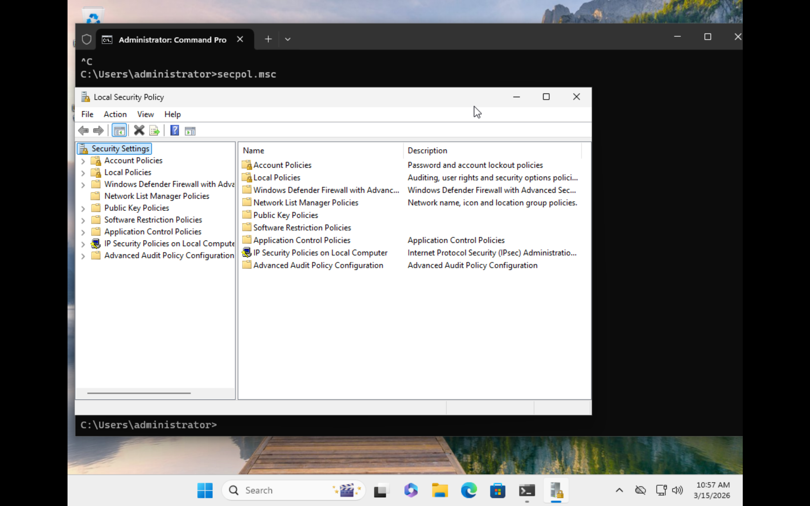
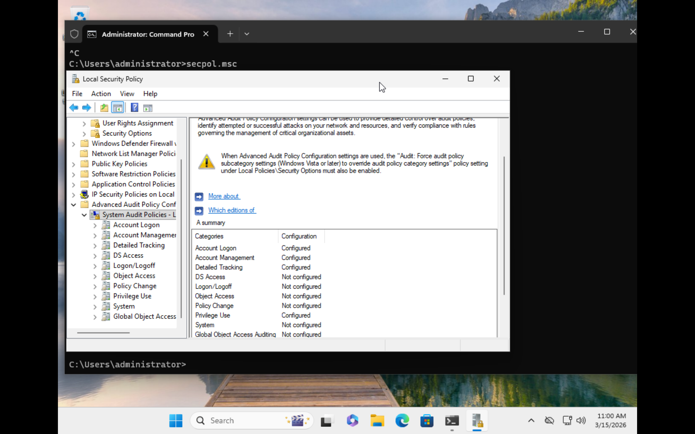
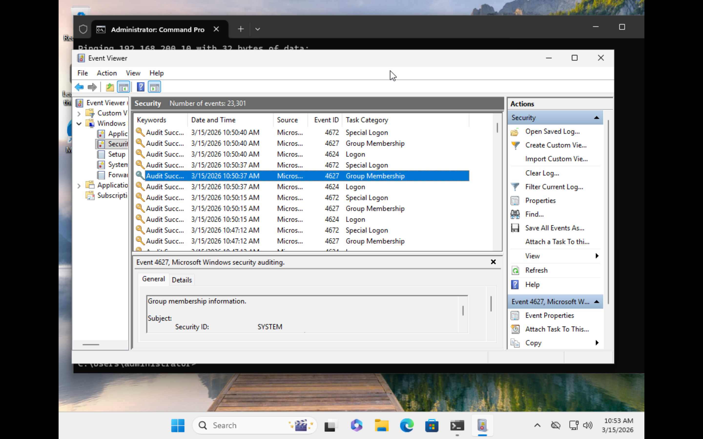

# Windows Advanced Audit Policy Configuration
## Objective

The objective of this lab was to enable detailed Windows security logging in order to capture authentication activity, privilege use, and process execution events.
These logs are critical for security monitoring and incident investigation.

## Background

Advanced Audit Policies allow administrators to configure detailed logging that provides visibility into:
- authentication attempts
- privilege usage
- process execution

## account management activity

### Tools Used
- Windows Local Security Policy
- Group Policy Editor
- Windows Event Viewer

### Step 1 – Open Local Security Policy:

### Step 2 – Enable:

- Logon Auditing
- Audit Credential Validation
- Process Creation Logging
- Audit Process Creation
- Command line Logging
- Command line in process creation events

This allows analysts to see the exact commands executed by processes, which is extremely valuable for detecting malicious activity.

### Step 3 - Logs were verified using Event Viewer:

##Outcome

Windows now produces detailed security logs that can be used for:
- authentication monitoring
- detecting suspicious processes
- analyzing security incidents

These logs will later be forwarded to the SIEM during Phase 3

